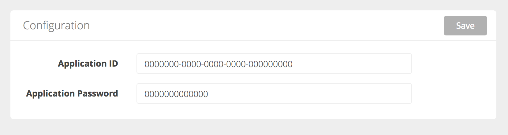

# Microsoft Bot Framework connector
# for Botpress (https://botpress.io/)


## Installation

```
botpress install botpress-msbotfw
```

## Get started

#### 1. Create a bot on [Bot Framework Developer Dashboard] (https://docs.botframework.com/en-us/csharp/builder/sdkreference/gettingstarted.html#registering)

#### 2. Setup Application Key & Password

To setup connection of your chatbot, you need to fill the application configurations directly in the module interface. 



You can also

- Set the bot application ID in env var MSBOTFW_APP_ID 
- Set the bot application password in env var MSBOTFW_APP_PASSWORD

#### 3. Set the webhook url in [Bot Framework config] (https://docs.botframework.com/en-us/csharp/builder/sdkreference/gettingstarted.html#registering)

The messaging endpoint must be **https://YOUR_DOMAIN/api/botpress-msbotfw/messages**


## Usage

### Incoming

You can listen to incoming events easily with Botpress by using the built-in "hear" function.
```js
bp.hear({platform: 'msbotfw', type: 'message'}, (event, next) => {
    const text = event.text
    const session = event.session
    
    bp.msbotfw.sendText(session, `You said ${text}`)
})
```

### Outgoing

#### Text messages
```js
bp.msbotfw.sendText(session, 'aMessage')
```

#### Attachments

You can use the Bot Framework attachment API described here: https://docs.botframework.com/en-us/csharp/builder/sdkreference/attachments.html

You can see how it is rendered on different platforms here: https://docs.botframework.com/en-us/channel-inspector/channels/Facebook 

```js
bp.msbotfw.sendText(session, {
    'contentType': 'application/vnd.microsoft.card.hero',
    'content': {
      'title': 'Who is it?',
      'subtitle': 'Guess who is on the picture',
      "images": [
        {
          "url": "https://upload.wikimedia.org/wikipedia/en/a/a6/Bender_Rodriguez.png"
        }
      ],
      'buttons': [
        {
            'type': 'postBack',
            'title': 'Bender Rodriguez',
            'value': 'insert_your_postback'
        },
        {
            'type': 'postBack',
            'title': 'R2D2',
            'value': 'insert_your_postback'
        }
      ]
    }
  })
```